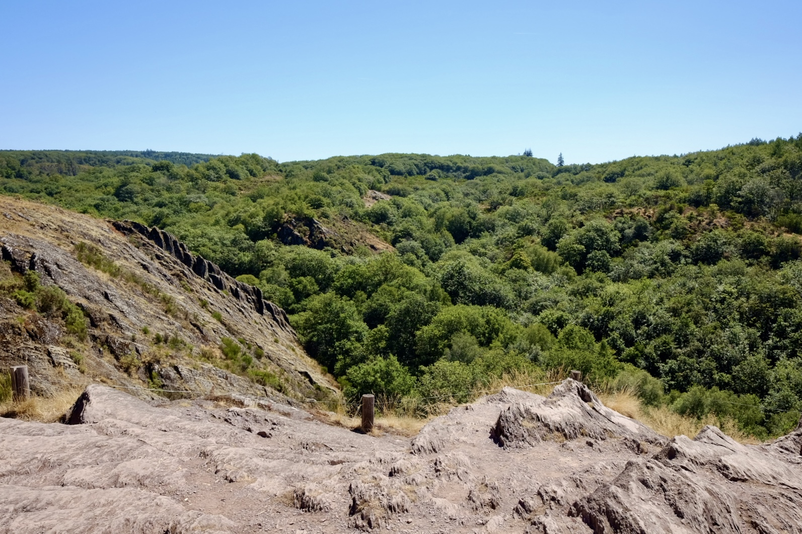

Salut,

J’ai lancé [vtt.bzh](https://www.vtt.bzh/?utm_source=nj-com&utm_medium=email&utm_campaign=rando-bretagne&utm_content=edito) en 2013 pour répondre à une question simple : où rouler dimanche ?

J’avais 25 ans, beaucoup d’idées et l’envie de faire de ce projet du soir un truc cool. Beaucoup de ces idées ont fini dans les abysses du web. Le calendrier est resté et a toujours eu toute mon attention.

Si vous êtes là depuis 2013, vous avez vieilli comme moi. Rien que pour ça, merci !

Parmi les fonctionnalités abandonnées, il y avait une première version du calendrier par e-mail. J’aimais ce support, mais je l’ai arrêté faute de temps. Le peu que j’avais était consacré à maintenir le calendrier à jour et à garder le site fonctionnel.

Depuis juillet, j’ai repris la newsletter dans une version brute, pour retrouver l’habitude. Aujourd’hui, je n’ai pas plus de temps libre, mais en déléguant une partie de la maintenance du site à l’IA, je peux l’utiliser différemment. Je peux de nouveau rouler, courir et raconter ce qui se passe sur les sentiers.

Cette édition ouvre une nouvelle étape. La newsletter s’appelle désormais **La Sortie**.

Le calendrier reste le cœur de vtt.bzh : un endroit simple pour trouver ou annoncer une randonnée. Ici, au lieu de vous renvoyer sa liste complète chaque mois, je souhaite vous aider à choisir : retenir quelques sorties, partager une information utile, une initiative de club ou un retour du terrain.

Le VTT reste l’axe central du calendrier, aux côtés des randonnées pédestres et du gravel. La Sortie suivra ce qui se passe sur les chemins bretons, sans perdre ce qui fait l’utilité première de vtt.bzh.

La Sortie est désormais envoyée et archivée sur [nicolasjouanno.com](https://www.nicolasjouanno.com/la-sortie/). Le calendrier complet, lui, reste sur vtt.bzh.

Place aux sorties d’octobre.

## La Sortie solidaire

Dans la dynamique d’**Octobre Rose**, donnez ce mois-ci un peu plus de sens à vos sorties d’automne en liant sport et soutien à la lutte contre le cancer.

### Octobre Rose

Randonnée VTT & Pédestre de La Chapelle-Thouarault (35), le 11 octobre. Cinq parcours VTT, dont un gravel, et cinq parcours pédestres au départ de la salle des Rochers. Une sortie locale inscrite dans la dynamique d’Octobre Rose.

Au-delà du calendrier vtt.bzh, l’**Octobre Rose** mobilise toute la région. Trois rendez-vous à retenir dans l’agenda officiel du CRCDC Bretagne :

- **La Kemper’Ose**: Quimper, le 4 octobre : course et marche solidaires.
- **La Vannetaise**: Vannes, du 9 au 11 octobre : marche, course, marche nordique et animations.
- **La Carentoirienne**: Carentoir, le 25 octobre : randonnée solidaire avec circuits pédestres, VTT et équestres.

[Voir l’ensemble des actions Octobre Rose en Bretagne](https://web.depistage-cancer.bzh/octobre-rose-2026-avec-liste-actions/).

### Recherche contre le cancer

Tous pour la Vie à Janzé (35), les 3 et 4 octobre. Une randonnée sur deux jours, avec du VTT, du cyclo, de la marche et du gravel. Les bénéfices sont reversés au Centre Eugène Marquis et à l’Institut Curie, pour la recherche contre le cancer et l’accompagnement des malades.

### Cancer du cerveau

Randoligo à Langolen (29), le 11 octobre. Une journée de marche et de VTT contre le cancer du cerveau, organisée par Oligocyte Bretagne. Quatre parcours pédestres, quatre parcours VTT et un rendez-vous qui donne une dimension solidaire à la sortie.

## L’agenda VTT

26 randos sont annoncées entre le 1er octobre et le 5 novembre, dont 9 nouvelles
ajoutées au calendrier ces 35 derniers jours. Elles se répartissent entre les Côtes-d’Armor
(6), le Finistère (1), l’Ille-et-Vilaine (12), la Loire-Atlantique (2) et le Morbihan (5).

### Week-end des 3 et 4 octobre

- **Tous pour la Vie** — samedi 3 · Janze (35)
- **36e Randonnée de la Vallée du Boël** — dimanche 4 · Guichen (35)
- **La Tredionnaise VTT** — dimanche 4 · Trédion (56)
- **Rando VTT / gravel / marche — Landehen** — dimanche 4 · Landehen (22)
- **Ronde du phacochére** — dimanche 4 · Saint-Aubin-d’Aubigné (35)
- **Tous pour la Vie** — dimanche 4 · Janze (35)

### Week-end des 10 et 11 octobre

- **Randonnée VTT & pédestre** — samedi 10 · La Chapelle-Thouarault (35)
- **29ème Rando du Marron de Redon** — dimanche 11 · Redon (35)
- **Kewenn VTT** — dimanche 11 · Quéven (56)
- **La Pordicaise** — dimanche 11 · Pordic (22)
- **La Rochespoir** — dimanche 11 · Maen Roch (35)
- **Marche de la Patate** — dimanche 11 · Ploeuc-sur-Lié (22)
- **Moulins et Marais** — dimanche 11 · Saint-Herblain (44)
- **Rando Kleg Saint Jo** — dimanche 11 · Cléguérec (56)
- **Rando VTT Bais** — dimanche 11 · Bais (35)
- **Rando des deux clochers** — dimanche 11 · Machecoul-Saint-Même (44)
- **Randoligo** — dimanche 11 · Langolen (29)
- **Randonnée des chataignes** — dimanche 11 · Pleslin-Trigavou (22)
- **Randonnée VTT & Pédestre** — dimanche 11 · La Chapelle-Thouarault (35)

### Week-end des 17 et 18 octobre

- **Randonnée de l’Illet** — samedi 17 · Chasné-sur-Illet (35)
- **Guip Ride** — dimanche 18 · Guipry-Messac (35)
- **La Kerdéhélienne** — dimanche 18 · Baud (56)
- **La Lou-Anne** — dimanche 18 · Pleumeur-Bodou (22)
- **La Visnonia — 26ème édition** — dimanche 18 · Férel (56)
- **Randonnée de l’Illet** — dimanche 18 · Chasné-sur-Illet (35)
- **Vetathlon Bobital** — dimanche 18 · Bobital (22)

Le calendrier complet et les détails pratiques sont sur [vtt.bzh](https://www.vtt.bzh/?utm_source=nj-com&utm_medium=email&utm_campaign=rando-bretagne&utm_content=calendrier).

## La Sortie en photo

📍[Paimpont](https://maps.app.goo.gl/zQG3AtCYShfiXrZr5?g_st=ic) - 2026-07-05 - 📷 Fujifilm x70 © Nicolas JOUANNO DANIEL

Une journée à marcher en famille dans la forêt de Brocéliande, sur les traces du siège de Merlin.

## Parlez de votre Sortie

Vous avez repéré une information utile, vous préparez une randonnée, vous voulez parler d’un projet de club ou raconter une sortie ? [Répondez à cet e-mail](mailto:contact@nicolasjouanno.com?subject=Une%20nouvelle%20pour%20La%20Sortie). Une sélection de vos messages pourra nourrir la prochaine édition, toujours avec votre accord avant publication.

## La Sortie se partage

Si cette édition vous aide à préparer votre prochaine sortie, transférez-la à votre club ou à la personne avec qui vous aimeriez partir. C’est le geste le plus simple pour soutenir le projet et faire circuler des informations utiles en Bretagne.

**Vous avez reçu cette lettre par transfert ?** [Recevez la prochaine édition](https://www.nicolasjouanno.com/newsletter/partage/).

À bientôt,

Nicolas
